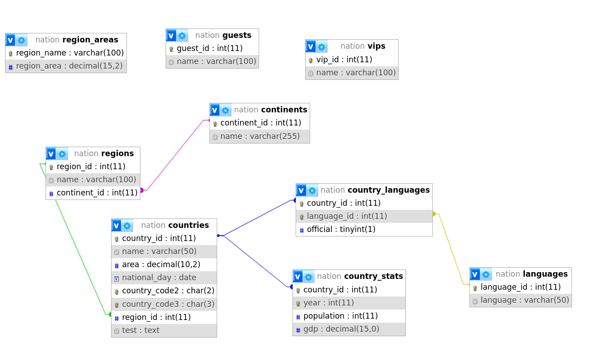
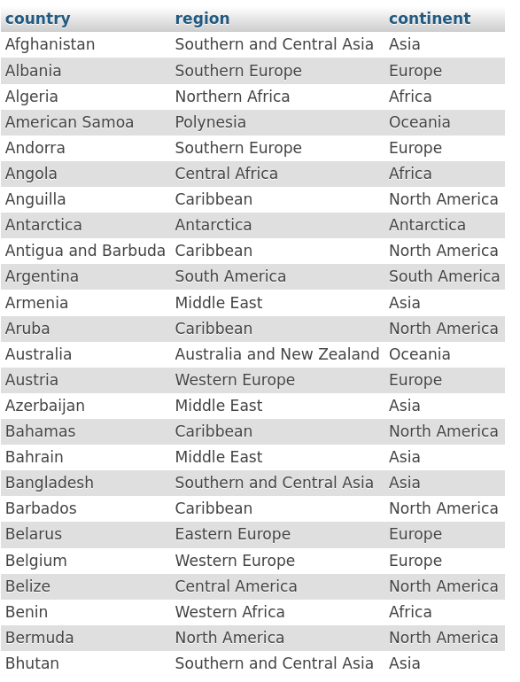
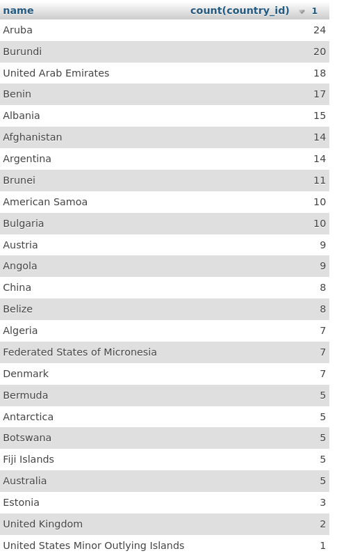

# FOAD SQL et PHP

## Git

- Récupérer tous les fichiers de ce dépôt afin **d'en créer un** sur votre compte **github** , le rendre **privé** m'envoyer une invitation pour que je puisse y avoir accès
- Mettre toutes les requetes dans un fichier `requete-prenom-nom.sql` 
- Votre travail se fera dans une branche nommée **developp**
- Faire 2 **branches** dans **developp** :
  - une branche pour les requetes **SQL** que vous nommerez **sql** 
  - une branche nommée **php** avec votre code **php**
- Vous devrez faire des commits fréquents (**atomiques**) , soigner l'**indentation** de votre code

## SQL

- Importer dans **phpmyadmin** la base de donnée [**nation**](./data/nation.sql) qui se trouve dans le dossier **data**

- Pour faire les requetes **SQL** ci-dessous s'appuyer sur le schema de la base de donnée 

- **Requete 1** : lister pour chaque **pays**,sa **region** et son **continent** 

`select 
    c.name country, 
    r.name region,
    t.name continent
from 
    countries c
inner join regions r using (region_id)
inner join continents t using (continent_id)
order by 
    c.name;`

- **Requete 2** : lister le **nombre de pays** dans chaque **region** en les classant du plus peuplé au moins peuplé 

`select name, count(country_id) from countries group by region_id order by count(country_id) desc;`

## PHP

Sur la base du modele **MVC** qu'on a vu ensemble faire un site web avec un **menu**  contenant **2 entrées** :
- Requete 1
- Requete 2

La page **requete 1** et **requete 2** devront contenir un **tableau html** qui correspond aux requetes **SQL** demandé plus haut.

Vous pouvez agrémenter tout ceci d'un zeste de **CSS** mais ce n'est pas un obligation.

Bon travail.